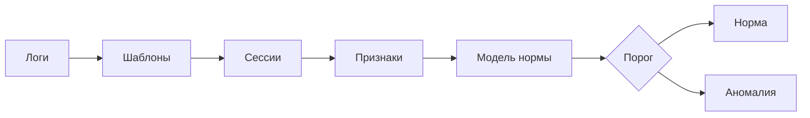

# Детектирование аномалий в логах распределенных систем

**Годовой проект магистратуры «Искусственный интеллект» · ФКН НИУ ВШЭ · 2026/27**

Тема 85 «Детектирование аномалий в данных распределенных облаков»

[Задача](#задача) · [Команда](#команда) · [План](#план-по-чекпойнтам) · [Данные](#данные) · [Литература](#литература)

---

## Задача

Узлы распределенной системы пишут логи — текстовые журналы событий. Сбоев в
кластере много, они разнообразны, а размеченных данных почти нет. Цель проекта —
построить модель, которая выучивает **нормальное** поведение системы по логам и
находит сессии, которые на него не похожи.

### Принципы, согласованные с куратором

| Аспект | Договоренность |
| --- | --- |
| **Обучение** | модели учатся на нормальных данных, метки нужны только для проверки |
| **Метрика** | главная — **recall**: пропущенный сбой дороже ложной тревоги |
| **Порог** | выбирается под целевой recall, а не под максимум F1 |
| **Методы** | от простых (PCA, Isolation Forest) к нейросетевым (DeepLog, LogAnomaly, трансформеры) |

## Команда

| Участник | GitHub | Telegram |
| --- | --- | --- |
| Погосян Артем Артурович | [@iamartempn](https://github.com/iamartempn) | [@iamartempn](https://t.me/iamartempn) |
| Поляков Степан Алексеевич | [@Spake4](https://github.com/Spake4) | [@kurulltyrbina](https://t.me/kurulltyrbina) |
| Шевыров Аркадий Николаевич | [@ArkadiyShevyrov](https://github.com/ArkadiyShevyrov) | [@ArkadiyShevyrov](https://t.me/ArkadiyShevyrov) |
| Мусаев Табриз Мурад оглы | [@tamumusaev](https://github.com/tamumusaev) | [@musatab89](https://t.me/musatab89) |

**Куратор:** Дмитрий Качкин, Telegram [@KachkinDmitrii](https://t.me/KachkinDmitrii)

## План по чекпойнтам

Срок ЧП1 объявлен, остальные сроки — ориентир по календарю прошлого года,
уточним после объявления графика на 2026/27.

| Этап | Срок | Содержание | Статус |
| --- | --- | --- | :---: |
| **ЧП1** | 06.10.2026 | знакомство с куратором, итоговая тема, план на год, репозиторий | ✅ |
| **ЧП2** | ~02.11.2026 | данные HDFS_v1 (loghub): парсинг, сессии, признаки, разведочный анализ; baseline — правило и PCA | ⏳ |
| **ЧП3** | ~03.12.2026 | модели без учителя: PCA, Isolation Forest, модель следующего события на n-граммах; логистическая регрессия как верхняя планка; выбор порога под recall | ⏳ |
| **ЧП4** | ~02.01.2027 | минимальный сервис: на вход строки лога сессии, на выход оценка и решение | ⏳ |
| **Предзащита** | ~10–14.01.2027 | промежуточные результаты | ⏳ |
| **ЧП5** | ~март 2027 | окна вместо сессий, признаки времени, второй датасет (BGL или HDFS_v3), по возможности собственные логи с внедренными аномалиями | ⏳ |
| **ЧП6** | ~05.05.2027 | нейросети, по подходу на участника: DeepLog, LogAnomaly, трансформер, четвертый по выбору; сравнение с ЧП3 | ⏳ |
| **ЧП7** | ~01.06.2027 | MLflow, воспроизводимость, анализ пропущенных аномалий, исследование порога | ⏳ |
| **Защита** | ~13–20.06.2027 | презентация и демо сервиса | ⏳ |

## Данные

Основной датасет — **HDFS_v1** из [loghub](https://github.com/logpai/loghub):
логи распределенной файловой системы Hadoop.

| Строк лога | Сессий (блоков) | Доля аномальных | Разметка |
| ---: | ---: | ---: | --- |
| ~11 млн | 575 061 | 2,93% | по блокам |

Данные в репозиторий не кладутся.

## Литература

1. He et al., 2016. *Experience Report: System Log Analysis for Anomaly Detection.* ISSRE
2. Xu et al., 2009. *Detecting Large-Scale System Problems by Mining Console Logs.* SOSP
3. Du et al., 2017. *DeepLog: Anomaly Detection and Diagnosis from System Logs through Deep Learning.* CCS
4. Meng et al., 2019. *LogAnomaly: Unsupervised Detection of Sequential and Quantitative Anomalies in Unstructured Logs.* IJCAI
5. Zhu et al., 2023. *Loghub: A Large Collection of System Log Datasets for AI-driven Log Analytics.* ISSRE

Код для сравнения: [loglizer](https://github.com/logpai/loglizer), [deep-loglizer](https://github.com/logpai/deep-loglizer).
